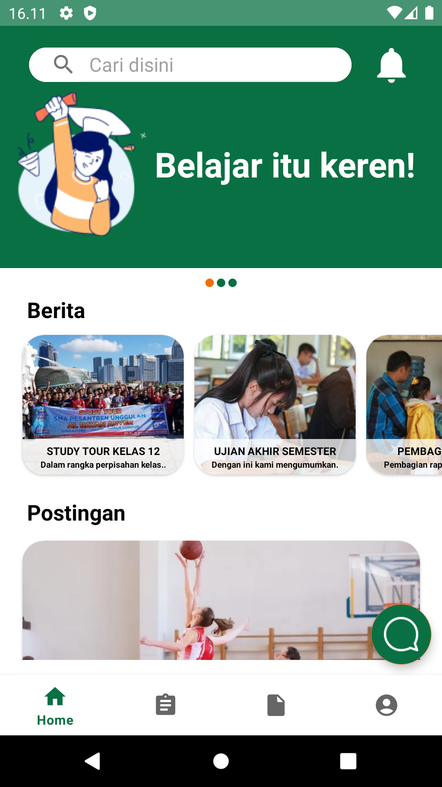
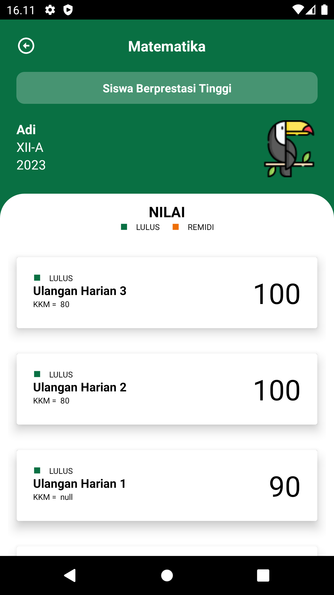
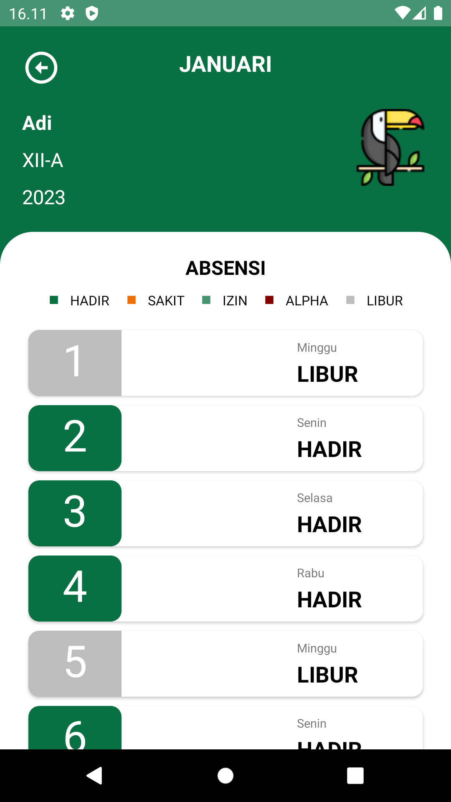
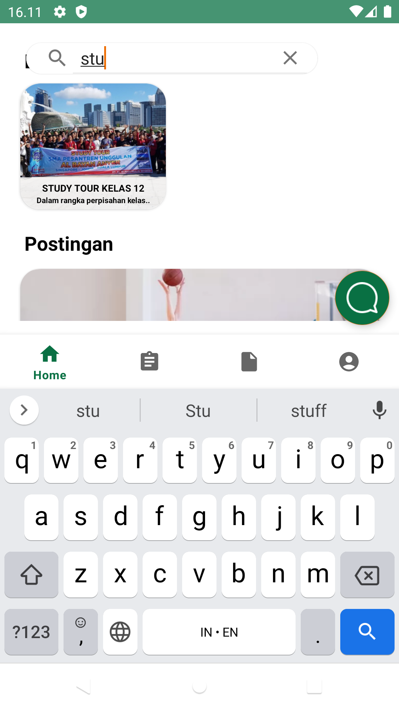
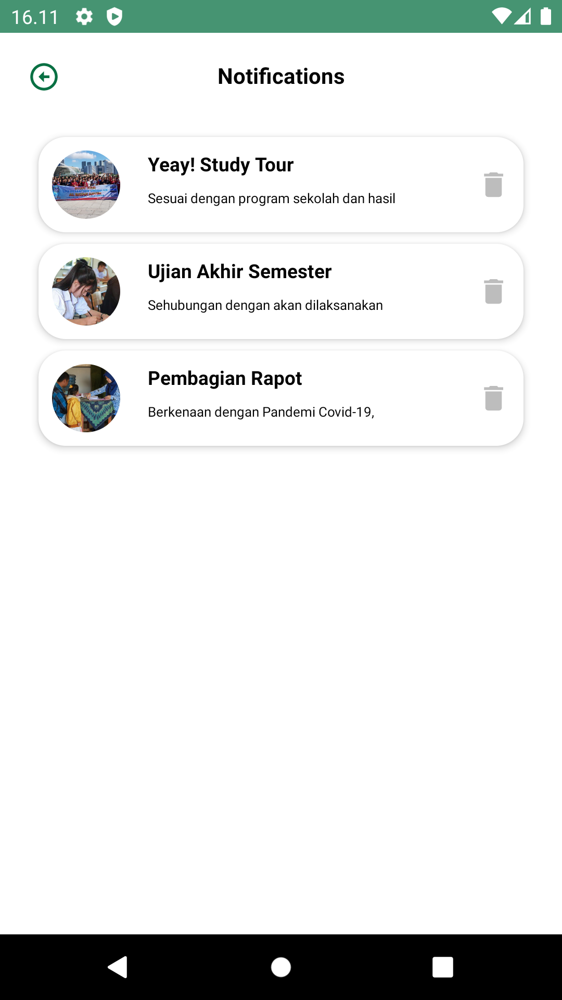
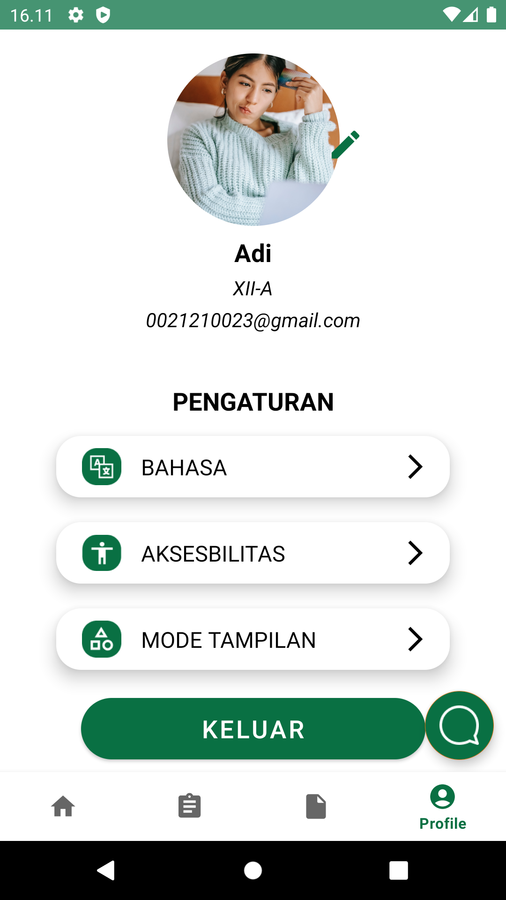
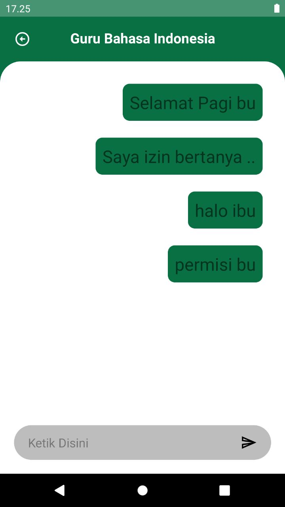

# **SEMA**

Student monitoring application for parents. This application displays various updates on student activities at school and provides daily attendance reports and student grades in each subject. In the application there is a feature that will categorize students in several statuses according to the prediction results that have been made in the machine learning model.
 

## **Links**
[Click here](https://drive.google.com/file/d/1E8lC2RtEVmq-mZdSoXQbUgbY4slkkDT-/view?usp=sharing) to download the application 
[Click here](hhttps://drive.google.com/file/d/17ZlpaV5t_vs7NTasVfBMXWH6J1IJ1fWg/view?usp=sharing) to see a demo of the application
 

## **Development**
Applications are developed using Android Jetpack. Data storage using Firestore database. The data obtained from the database is then posted via the Machine Learning Model API. API Service will return the results of data processing from the model which is then displayed on the User Interface
 

## **Available features**

| Home | Scores | Absence |
|------|--------|---------|
| |  | |

| Search | Notification | Profile |
|--------|--------------|---------|
| |  | |

| Chat | | |
|------|--------------|---------|
|| | |